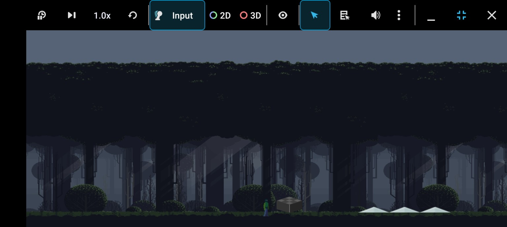
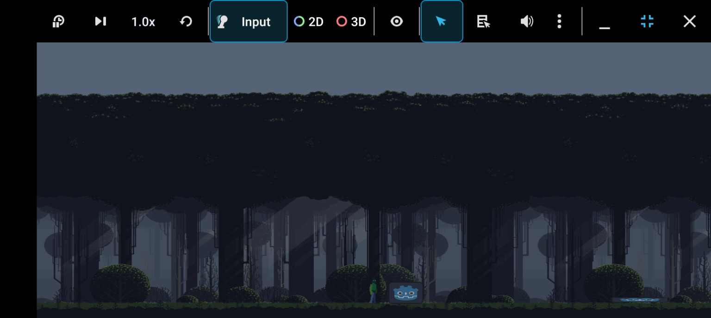
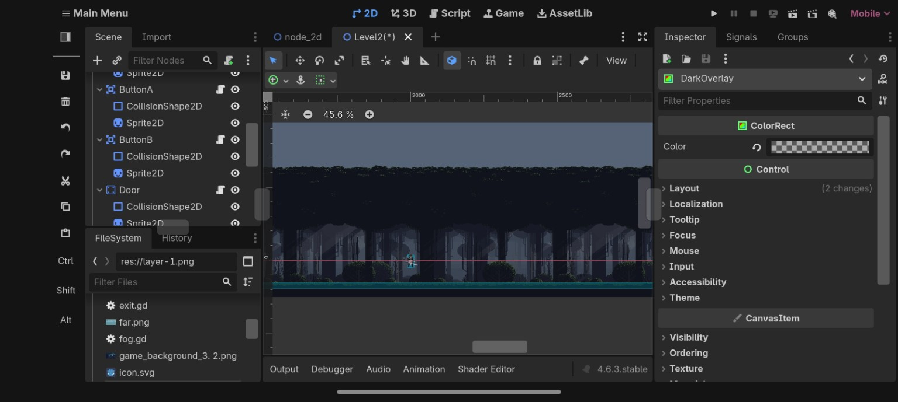

# Inside-Style Game

A 2D puzzle-platformer project inspired by the atmosphere and gameplay style of *Inside*, built with Godot.

## Screenshots

### Gameplay

### Puzzle / Interaction

### Development

## Features

- 2D player movement
- Jumping and character animations
- Pushable objects
- Interactive buttons
- Door mechanism
- Puzzle logic using multiple buttons
- Atmospheric forest environment
- Camera-based gameplay
- Level-based scene structure

## Built With

- **Godot 4.6.3**
- **GDScript**

## Current Progress

The project is currently in active development. The core movement, environmental interaction, object-pushing, and button/door puzzle mechanics have been implemented, with further levels, puzzles, enemies, and environmental polish planned.

## Controls

- **Left / Right Arrow** — Move
- **Space** — Jump

## Inspiration

This project is a learning and development project inspired by the visual atmosphere and puzzle-platforming style of *Inside*. It is an original project and is not affiliated with or a remake of the original game.
